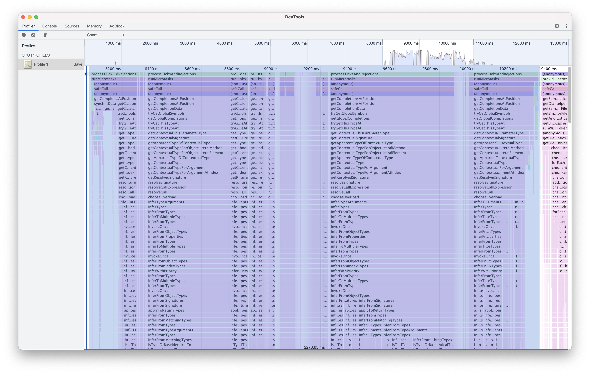
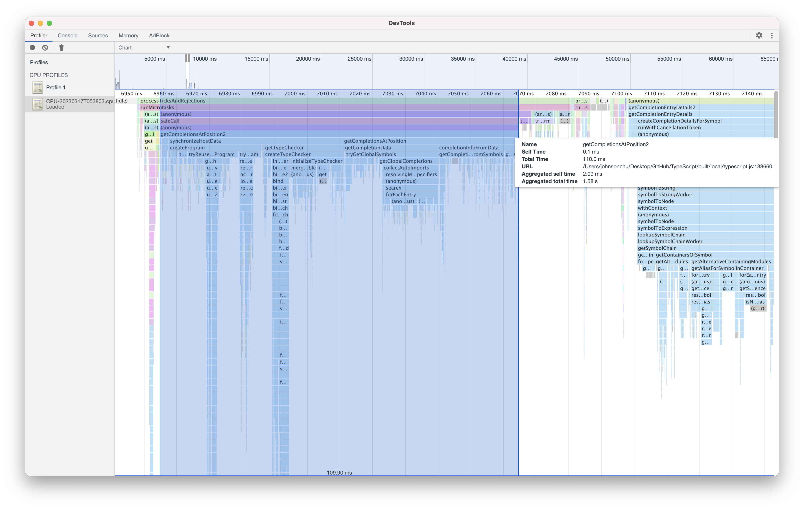

# TypeScript 10x faster POC

This POC is designed to investigate whether there is potential to improve TypeScript IntelliSense performance tenfold.

I have noticed that TypeScript's type evaluation is coupled with the AST, and even minor changes may require a lot of time to recalculate for unchanged portions, due to triggering AST nodes that require more type evaluation work.

In the following example, `a` is not used in the return statement and we changed its value to `2`. However, `a` is a child node of `defineComponent()` in the AST, so it will still recalculate the type of `defineComponent()`, causing a noticeable lag in the automatic completion when typing in `setup()` compared to outside of `setup()`. 

```ts
import { defineComponent } from 'vue';

export default defineComponent({
    setup() {
        const a = 1;
        return { };
    }
});
```

This is just an illustrative example, and in reality, project scenarios can be much more complex, and performance hotspots are often difficult to identify.

Ideally, we would like TypeScript to be able to recalculate types more finely and cache the results of type calculations independently of the AST.

Achieving this goal requires a very large amount of work, and the implementation itself is quite challenging. To our knowledge, no language currently provides this level of fine-grained type calculation for IntelliSense.

In this POC, I naively assume that if all attributes of the new AST Node and Parent Nodes are the same as the old AST, we can reuse the old type calculation results directly, to pretend that we have fine-grained incremental type calculation.

In a real project that uses `defineComponent()`, automatically completing in `setup()` before "fine-grained incremental type calculation" takes about 2000ms of time.



After supporting "fine-grained incremental type calculation", the time is reduced to 110ms.



In this example, the performance improvement has reached the intended goal of tenfold, but of course, it does not mean that such a significant improvement will be achieved in all cases. It depends on the actual performance bottlenecks of the code.

However, it still shows that fine-grained incremental type calculations have great potential for improving the performance of IntelliSense.

## Try it Yourself

Note: This POC is only used to test performance differences, and the type behavior is not accurate.

- Clone https://github.com/microsoft/TypeScript
- Copy `checker.ts`, `checkCache.ts` to `src/compiler` in `TypeScript` repo
- Run `$ npm i && npm run build` in `TypeScript` repo
- Add `"typescript.tsdk": "absolute_path_to_ts_repo/built/local"` to `.vscode/settings.json` in your project

---

Thanks for the guidance from the TS Team.
